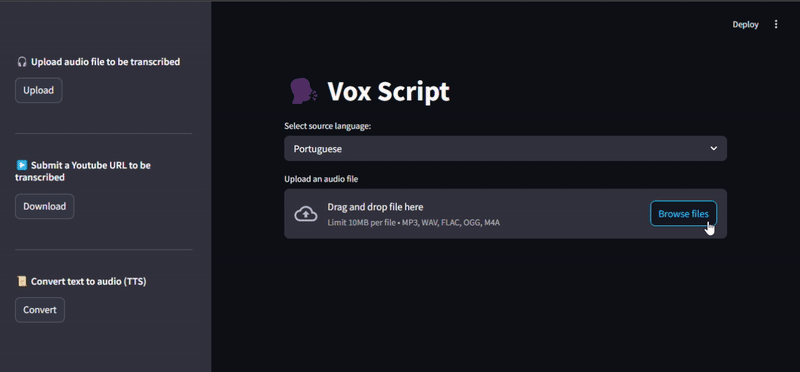
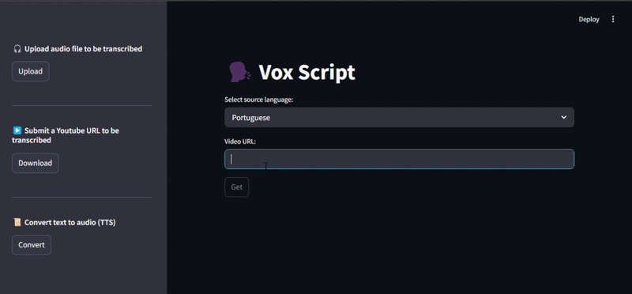
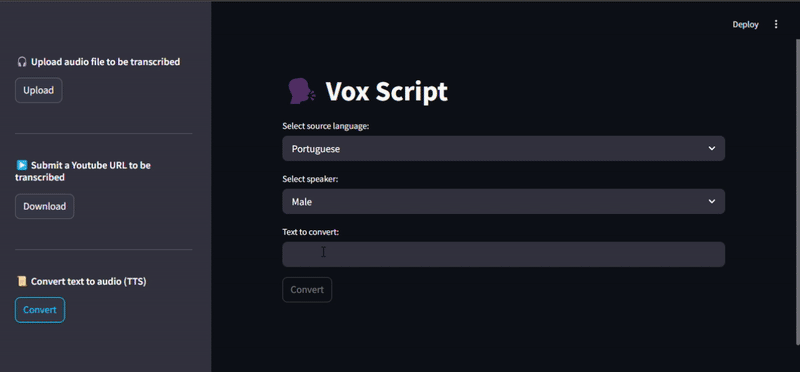
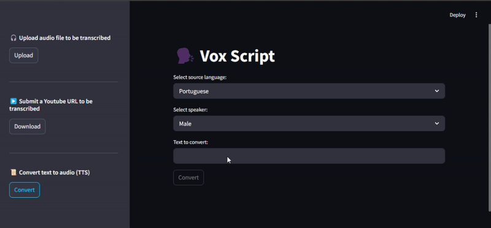

# 🗣️ VOX SCRIPT

Project developed to apply TTS and STT techniques using PyTorch as well as transcribe YouTube videos from the URL

## ✨ Features

- **Automatic Transcription:** Converts audio to text with high precision using STT techniques.
- **Voice Synthesis:** Transforms text into audio naturally and fluently using TTS.
- **YouTube Integration:** Allows transcribing YouTube videos from a URL.
- **Interactive Interface:** Application built with Streamlit for easy access to project features.
- **Multilingual Support:** Compatible with several languages to meet various needs.

## 📚 Resources

- [Python](https://www.python.org/downloads/)
- [PyTorch](https://pytorch.org/)
- [Streamlit](https://streamlit.io/)
- [CoquiTTS](https://pypi.org/project/coqui-tts/)
- [Transformers](https://huggingface.co/docs/transformers/index)
- [yt-dlp](https://pypi.org/project/yt-dlp/2021.3.7/)

<br>


<br>

## What is STT?

STT (Speech-to-Text) transforms speech into text. It analyzes sound waves, identifies phonemes and words with algorithms and acoustic models. Used in voice assistants, dictation, transcription, subtitles, customer service and accessibility. It facilitates voice interaction.

## What is TTS?

TTS (Text-to-Speech) is a technology that converts written text into synthesized speech. It works by analyzing text, breaking it down into phonemes, and using an acoustic model to generate the corresponding speech. It is used in virtual assistants, voice navigation, and more.

## 🚀 Installation

Clone the repository:

```bash
git clone https://github.com/ganascimento/vox-script.git
cd vox-script
```

Install packages:

```cmd
sudo apt update
sudo apt install ffmpeg
```

Make sure you have the required packages installed:

- torch
- torchaudio
- soundfile
- transformers
- yt-dlp
- streamlit

```cmd
pip install torch torchaudio soundfile transformers yt-dlp streamlit
```

## 🧪 Test/Run Project

See your models:

```cmd
tts --list_models
tts --list_models | grep '<lang>'
```

Navigate to the `src` folder.

Run the Streamlit application:

```cmd
streamlit run main.py
```

## 🌟 Examples

### Convert audio to text (SST)

<div style="display: flex; justify-content: center; gap: 10px">
    <p align="center">
        
        <br>
        <em>Example: Speech-to-Text.</em>
    </p>
</div>

### Convert Youtube audio to text (SST)

<div style="display: flex; justify-content: center; gap: 10px">
    <p align="center">
        
        <br>
        <em>Example: Speech-to-Text from Youtube.</em>
    </p>
</div>

### Convert text to audio

<div style="display: flex; justify-content: center; gap: 10px">
    <p align="center">
        
        <br>
        <em>Example: Text-to-Speech in PT.</em>
    </p>
    <p align="center">
        
        <br>
        <em>Example: Text-to-Speech in EN.</em>
    </p>
</div>
